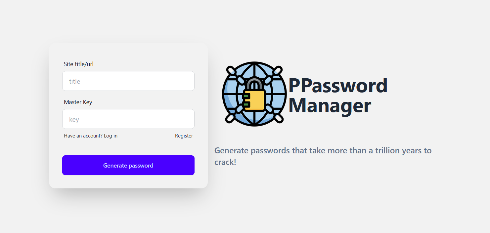
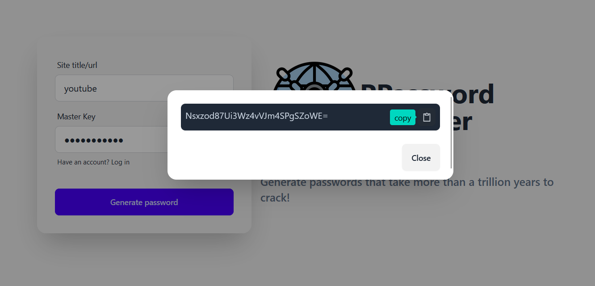
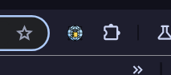

# PPassword-Manager
***

PPassword manager is a new solution designed to change the way you think about your passwords. Using Ppassword manager, you can generate much more secure passwords for all your websites using a single master key. And the cool thing is that you do not have to worry about your password being stolen or hacked, since they are not stored at all.

## How does it work

Everytime you request a password for any website, the PPassword manager **chrome extension** takes the website's title and your master key and generates a secure password for you. For every website-masterkey pair, it would generate the same password over and over again. So instead of storing your passwords directly in some database, it takes a more secure approach by regenarating your passwords based on some parameters, the parameters begin your site's title/url and your master password.
The extension provided will automatically guess the site's name for you everytime you visit some website, however you can modify that input as you wish in case the extension gets that name wrong.

## Architecture

***

  
📣 Note!!

  
This is not the final release and will be updated in the future.

### Core functionality

> In case you are not satisfied with a minimal extension and want a full-fledged password manager that remembers your generation history as well, you can use the **Vuejs** client. You would need to register yourself and for every password that you create, the backend api would store the website's url/title in the database. It would be provided to you at login so you can view your websites and regenerate the password.

### User authentication

### VueJS client

***

## Screenshots

### Client

### Extension

<!--  -->

<!-- ### Vuejs client -->

## Technologies used

- C#, .NET
- Minimal API
- SQLite DB
- Entity Framework Core
- Javascript
- Vuejs
- TailwindCSS
- .NET Identity Framework
- [K6](https://k6.io/) for load testing

***

## [API Endpoints]

**API URL:** https://ppmapi20240106013303.azurewebsites.net/

See documentation [here](./PPM_API/Tests/endpoints_test.http)
